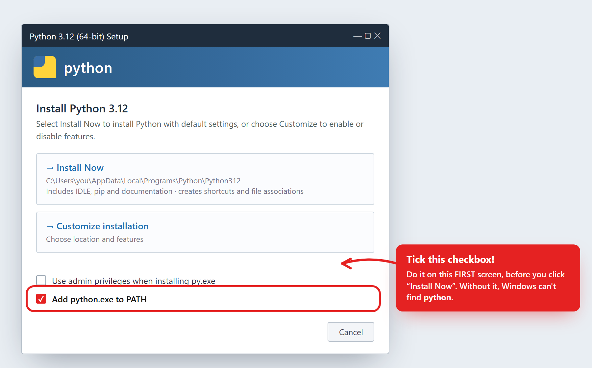
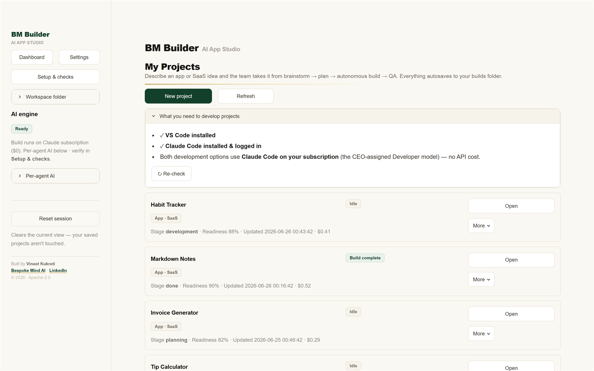
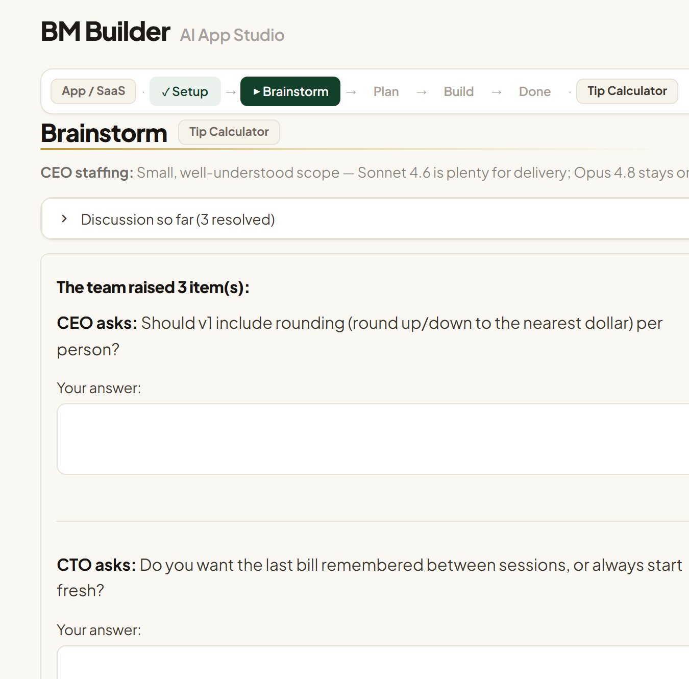
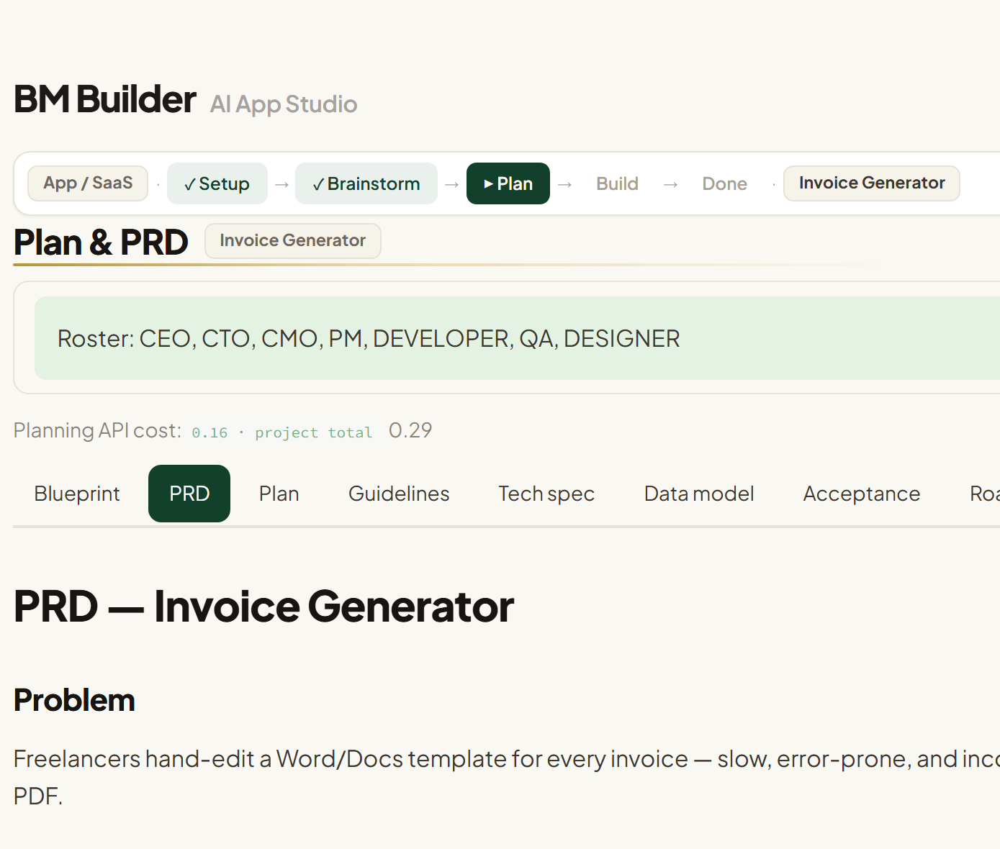
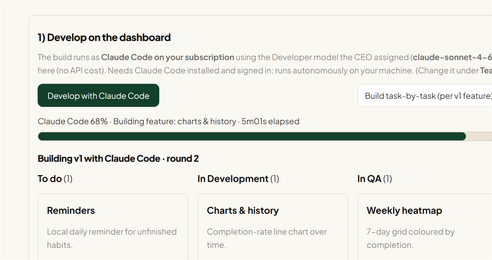
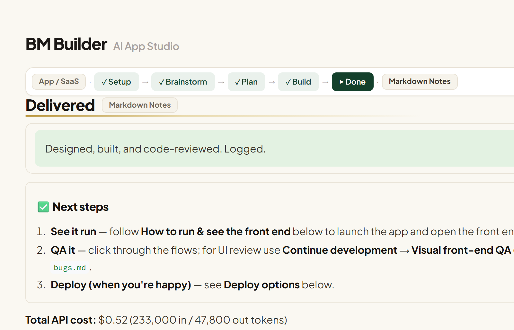

# BM Builder — AI App Studio

_By [Vineet Kukreti](https://linkedin.com/in/vineet-kukreti) · [Bespoke Mind AI](https://bespokemind.ai) · Apache-2.0_

**Turn an app or SaaS idea into a real, built project — locally, with an AI executive team that you stay in control of.**

BM Builder is a local-first [Streamlit](https://streamlit.io) app. You describe an idea; a simulated executive team (CEO, CTO, CMO, PM, QA, and a Skeptic) brainstorms it with you, authors a full plan (PRD, plan, tech spec, data model, roadmap, red-team review), then **autonomously builds the project with [Claude Code](https://docs.anthropic.com/en/docs/claude-code)** — or hands a ready-to-build brief off to VS Code. It tracks cost as it goes and learns reusable craft from your feedback.

Everything runs on your machine. Your idea, your code, and your keys never leave your computer except as calls to the AI provider you choose.

> 🆘 **Install hiccup on Windows?** The two most common errors — *"Python was not found…"* and *"'streamlit' is not recognized…"* — each have a one-line fix in **[Troubleshooting](docs/HELP.md#troubleshooting)**.

---

## ▶️ Run it (after you download)

**No file paths to edit** — the app works wherever you save it. Unzip the download (or `git clone` it), then **open a terminal in that folder**.

### Easiest — one command

This creates a virtual environment, installs everything, and launches the app:

```powershell
# Windows (PowerShell)
.\run.ps1
```
```bash
# macOS / Linux
chmod +x run.sh && ./run.sh
```

If it stops with **"Python was not found,"** do the one-time **Install Python** step below, open a **new** terminal, and run it again.

### Step by step (if you prefer, or the launcher won't start)

1. **Install Python 3.9+ and make sure your terminal can find it.**
   - **Windows (smoothest path):** download the installer from **[python.org/downloads](https://www.python.org/downloads/)**, run it, and on the **first screen tick "Add python.exe to PATH"** *before* clicking **Install Now**:

     

     **Or skip the GUI** — in PowerShell run:
     ```powershell
     winget install Python.Python.3.12
     ```
     winget installs Python and adds it to PATH for you (no checkbox to tick) — just **open a new terminal** afterwards so the PATH change takes effect.

     **Don't see a checkbox?** That's expected with `winget`, or if Windows sent you to the **Microsoft Store** — just run the `python --version` check below; if it fails, use the one-line fix in **🪟 Windows gotchas** further down.
   - **macOS:** `brew install python`, or download from [python.org](https://www.python.org/downloads/).
   - **Linux:** `sudo apt install python3 python3-pip python3-venv` (Debian/Ubuntu).

   Then confirm it works — you should see `Python 3.x`:
   ```powershell
   python --version
   ```
   (If you instead see *"Python was not found…"*, jump to **🪟 Windows gotchas** below.)

2. **Install the dependencies** — use `python -m pip` (more reliable than a bare `pip`):
   ```powershell
   python -m pip install -r requirements.txt
   ```

3. **Start the app** — run Streamlit *through Python* so you don't need it on your PATH:
   ```powershell
   python -m streamlit run app.py
   ```

The app opens in your browser. **On the first run, click "Setup & checks" in the sidebar** — a guided screen lets you pick your AI provider (Claude subscription or an API key) and paste your key, with no files to edit. Then click **New project** and you're off.

> **🪟 Windows gotchas (the two most common — both quick to fix):**
>
> - **`Python was not found; run without arguments to install from the Microsoft Store…`**
>   Windows is intercepting the `python` command. Either **(a)** reinstall from [python.org](https://www.python.org/downloads/) with **"Add python.exe to PATH"** ticked, **or (b)** turn the alias off: **Settings → Apps → Advanced app settings → App execution aliases** → switch **off** the `python.exe` and `python3.exe` entries. Open a **new** terminal afterwards.
>   *Tip:* the **`py`** launcher often works even when `python` doesn't — try `py --version`, then use `py -m pip install -r requirements.txt` and `py -m streamlit run app.py`.
>
> - **`streamlit : The term 'streamlit' is not recognized…`**
>   Don't call `streamlit` directly — run it through Python: **`python -m streamlit run app.py`** (that's why the steps above use `python -m`).

> 📖 Want every option spelled out (installing Python/Node, each provider, troubleshooting)? See the **[full Setup Guide → docs/SETUP.md](docs/SETUP.md)**. · Using the tool day to day: **[docs/HELP.md](docs/HELP.md)**.

---

## Screenshots

Describe an idea, then watch it move from **brainstorm → plan → autonomous build → delivered**.



| | |
|:--|:--|
| **1 · Brainstorm** — the team asks sharp questions; a readiness score climbs | **2 · Plan** — a real PRD, tech spec, data model & roadmap |
|  |  |
| **3 · Build** — Claude Code builds it live across a Kanban board | **4 · Delivered** — a run guide, cost breakdown, and next steps |
|  |  |

---

## Why it's different

- **You're in the loop, not on the sidelines.** The team asks you focused questions in small batches and shows a live "readiness" score before it commits to a plan.
- **Real artifacts, not just chat.** Each project becomes a folder with a PRD, plan, tech spec, data model, roadmap, and generated source code.
- **Autonomous builds at $0.** Builds run through your **Claude Code subscription**, so the heavy lifting doesn't burn API credits. An Anthropic API key is optional and used as a metered fallback.
- **Per-agent AI, your choice.** Set each agent (CEO, CTO, CMO, PM, QA, Skeptic) to the Claude subscription, the Anthropic API, OpenAI, or any OpenAI-compatible endpoint (Groq, OpenRouter, custom) — individually, in Settings.
- **Review & override.** The CEO assigns models per role and writes a project summary, but you can change any model pick and edit the roadmap before building.

---

## How it works

```
Dashboard → New project → Brainstorm → Plan & PRD → Development → Delivered
```

1. **Setup** — Name the project and describe your idea. Optionally upload a brief (PDF / Word / HTML / text) to auto-fill requirements, and attach reference material (mockups, API docs, sample data). Pick how deep planning should go and which agents run on your subscription vs. the metered API.
2. **Brainstorm** — The team raises questions and suggestions in small batches. You answer; a readiness score climbs as the picture fills in.
3. **Plan & PRD** — In the background, multiple agents author the PRD, plan, tech spec, data model, blueprint diagram, red-team review, and a prioritized roadmap.
4. **Development** — Build it three ways:
   - **Develop on the dashboard** with Claude Code (it writes, runs, and fixes the project autonomously).
   - **Build task-by-task** (one focused Claude Code run per v1 roadmap feature — better for large projects).
   - **Open in VS Code** with a generated `CLAUDE.md` build brief and develop there.
5. **Delivered** — A run guide, cost breakdown, and full project folder. Continue iterating, or plan a v2/v3 with the current build as context.

---

## Requirements

- **Python 3.9+**
- **An AI provider** — at least one of:
  - **Claude Code** (recommended, $0 builds) — **requires [Node.js](https://nodejs.org)**, which provides the `npm` command. Install Node first (`winget install OpenJS.NodeJS.LTS`, or [nodejs.org](https://nodejs.org)), **open a new terminal**, then run `npm install -g @anthropic-ai/claude-code` and `claude` once to sign in. Required for autonomous builds. *(Seeing `npm is not recognized`? Node.js isn't installed yet.)*
  - **An Anthropic API key** — recommended for metered fallback and visual/screenshot review. Get one at [console.anthropic.com](https://console.anthropic.com/settings/keys).
  - Optionally: an OpenAI key or any OpenAI-compatible endpoint for non-Claude agents.
- **VS Code** with the `code` command on your PATH — only if you want the "Open in VS Code" handoff.

---

## Models & cost

- **All cloud agents default to your Claude subscription ($0).** Each call falls back to the metered Anthropic API automatically if Claude Code is unavailable or returns invalid JSON.
- **The autonomous code build always uses the Claude subscription** — OpenAI and other providers can't drive Claude Code.
- The app tracks **metered API spend** per project and per phase (planning, build, QA). Subscription-routed work shows as $0.
- Cost for non-Claude providers is billed by that provider and isn't tracked here.

Change the default provider and per-agent routing anytime in **Settings** and the project **Setup** screen.

---

## Privacy & security

- **Local-first, single-user.** Projects live on your disk under your Builds path. Nothing is uploaded except your prompts to the AI provider you select.
- **Secrets stay local and git-ignored.** Keys live in `.env` and/or `settings.json` (plaintext, same trust model as any local dotfile). Both are listed in [.gitignore](.gitignore) so they're never committed.
- **Not hardened for multi-user/server deployment.** Per-project JSON writes aren't fully lock-serialized for concurrent users. Run it locally.
- If you fork or share this repo, double-check you haven't committed `.env`, `settings.json`, or anything under `workspace_builds/`.

---

## Project layout

```
BM Builder/
├── app.py                  # Streamlit entry: dashboard, project flow, Setup hub, stage router
├── engine/                 # orchestration engine (split by concern)
│   ├── core.py             #   kernel: LLM routing, registry, persistence, cost, build, planning
│   ├── errors.py           #   EngineError + the call_agent failure-sentinel detector
│   ├── models.py           #   typed shapes for the JSON artifacts
│   ├── graph.py            #   brainstorm whiteboard (Graphviz DOT)
│   ├── reports.py          #   client-facing report export
│   └── usecases.py         #   staffing + brainstorm orchestration (UI-thin)
├── dashboard_engine.py     # backward-compat facade re-exporting the engine package
├── theme.py                # "Forest & Gold" light UI theme (CSS injection)
├── tests/                  # unit tests (python -m unittest discover -s tests)
├── requirements.txt
├── run.ps1 / run.sh        # one-command launchers (Windows / macOS-Linux)
├── .env.example            # copy to .env and add your key
├── LICENSE                 # Apache 2.0
├── NOTICE                  # attribution (must be retained in copies)
├── AUTHORS.md
├── CONTRIBUTING.md
├── .streamlit/config.toml  # theme config
└── docs/
    ├── SETUP.md            # step-by-step install (start here)
    ├── HELP.md             # usage walkthrough + troubleshooting
    └── FEATURE_IDEAS.md    # suggested roadmap / future features
```

Each project you create gets its own folder under your Builds path containing `project.json`, `prd.md`, `plan.md`, the generated source, a `RUN_GUIDE.md`, history, and more.

---

## Contributing

Issues and pull requests are welcome — see **[CONTRIBUTING.md](CONTRIBUTING.md)**. Please don't include personal data, API keys, or client-specific content in code, examples, or screenshots.

---

## Built by

**BM Builder is created and maintained by [Vineet Kukreti](https://linkedin.com/in/vineet-kukreti), founder of [Bespoke Mind AI](https://bespokemind.ai).**

Bespoke Mind AI builds tailored AI systems, agents, and automations for businesses. If you'd like a custom AI tool, an agentic workflow, or help shipping AI into your product:

- 🌐 Website: **[bespokemind.ai](https://bespokemind.ai)**
- 💼 LinkedIn: **[linkedin.com/in/vineet-kukreti](https://linkedin.com/in/vineet-kukreti)**

If BM Builder is useful to you, a star ⭐ and a mention are appreciated.

## License & attribution

© 2026 **Vineet Kukreti (Bespoke Mind AI)**. Released under the **[Apache License 2.0](LICENSE)**.

You're free to use, modify, and distribute it, **provided you retain the copyright and [NOTICE](NOTICE) attribution** in copies and derivative works. The names "BM Builder", "Bespoke Mind AI", and "Vineet Kukreti" are **not** licensed as trademarks and may not be used to imply that the author endorses, or wrote, your modified version (License §6). See **[NOTICE](NOTICE)** and **[AUTHORS.md](AUTHORS.md)**.
